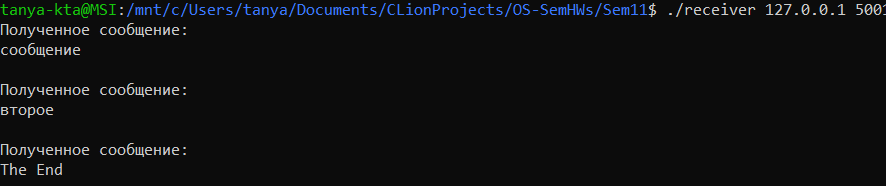

# Отчет по домашним заданиям с семинаров
## Кадыкова Татьяна Алексеевна, БПИ213

Примеры работы программ присутствуют на картинках.

### Семинар 2
Ознакомиться и привести работающие примеры
использования следующих инструкций языка bash: if, while, функции.
Программа сопровождена комментариями.

### Семинар 3
Разработать программу в которой родительский процесс вычисляет
число Фибоначчи, а процесс-ребенок вычисляет значение
факториала.

Первый параметр командной строки задает номер числа Фибоначчи 
и число под факториалом. Программа создает дочерний процесс и выводит оба полученных значения.

### Семинар 4
Разработать программу использующую для работы с текстовыми
файлами системные вызовы. Программа на языке C должна
прочитать, используя буфер, размер которого превышает читаемые
файлы и записать прочитанный файл в файл с другим именем.
Имена файлов для чтения и записи задавать с использованием
аргументов командной строки.

Запуск программы через: `./run <input file> <output file>`, компиляция без дополнительных флагов.
Программа, используя системные вызовы, копирует содержимое входного файла в выходной.
Пример результата лежит в соответствующей папке.

### Семинар 5
Разработать программы, реализующие двусторонний обмен
данными по именованным каналам. То есть организовать их
взаимодействие как независимых процессов.

Программа принимает на вход имя входного и выходного файла, 
далее имя канала для записи (3ий параметр, канал, куда будет записано содержание входного файла), и 
последний - имя канала для чтения (откуда будет взято содержание для записи в выходной файл).
Пример результата лежит в соответствующей папке, запускаем 2 процесса - в параметрах 3 и 4 нужно поменять местами.

### Семинар 6
Разработать программы клиента и сервера, взаимодействующих
через разделяемую память с использованием функций UNIX
SYSTEM V. Клиент генерирует случайные числа в том же
диапазоне, что и ранее рассмотренный пример.
Сервер осуществляет их вывод. Необходимо обеспечить
корректное завершение работы для одного клиента и сервера, при
котором удаляется сегмент разделяемой памяти.

Сначала запускается клиент(`./client <number of randoms>`), он генерирует указанное число случайных чисел и
записывает их в разделяемую память. Далее запускаем сервер (`./server <number of randoms>`) и он печатает
из разделяемой памяти эти числа.

### Семинар 7
Разработать программы клиента и сервера, взаимодействующих
через разделяемую память с использованием функций POSIX.
Клиент генерирует случайные числа в том же диапазоне, что и
ранее рассмотренный пример. Сервер осуществляет их вывод.
Необходимо обеспечить корректное завершение работы для
одного клиента и сервера, при котором удаляется сегмент
разделяемой памяти. Предложить и реализовать свой вариант
корректного завершения.

Работа аналогична семинару 6. При компиляции требуется добавить `-lrt`.

### Семинар 9
Реализовать для родительского и дочернего процесса
двухстороннюю связь с использованием только одного неименованного
канала (pipe) и циклической организацией обмена посредством
семафора. При этом канал должен быть постоянно открытым. Обмен
должен завершаться после поочередной передачи в каждую сторону
по десять сообщений. По завершении обмена обеспечить корректное
закрытие каналов и удаление семафора.

Программа инициализирует семафоры UNIX System V, 2 штуки - для корректной передачи управления
другому процессу. Первым начинает родительский процесс - он отправляет сообщение формата 
`Сообщение номер <номер сообщения>`, делает post на семафор дочернего процесса и ждет поста на свой семафор,
после чего печатает: `Родитель: получено сообщение` и на следующей строке само сообщения.

Дочерний процесс делает аналогичные действия, но сначала ждет post на свой семафор, 
печатает сообщение, отправляет новое и делает post на семафор родителя. И так оба процесса отправляют
10 сообщений через неименованный канал pipe, который полностью открыт во время работы.

### Семинар 10
Побитовая передача целого числа от одного процесса другому с
помощью сигналов SIGUSR1, SIGUSR2. Необходимо написать две
программы — передатчик и приемник, которые будут запускаться с
разных терминалов. Каждая программа вначале печатает свой
PID и запрашивает ввод с клавиатуры PID программы–собеседника
(вводится пользователем). Порядок ввода PID не имеет значения.
Программа—передатчик запрашивает с клавиатуры ввод целого
десятичного числа (число может быть и отрицательным!). Введенное
число побитово передается программе-приемнику с использованием
пользовательских сигналов SIGUSR1 и SIGUSR2. Программа–
приемник после завершения приема печатает принятое число в
десятичной системе счисления.

После обмена PID программа отправитель посылает получателю сигналы: нулевой бит - сигнал SIGUSR2,
единичный - сигнал SIGUSR1, с помощью команды kill, причем в порядке от старшего к младшему. 
Получатель обрабатывает сигналы с помощью функций handle и соединяет биты в единое число.

### Семинар 11
Разработать клиент-серверное приложение, использующее TCP/IP и
реализующее следующие взаимодействия: клиент №1 передает
сообщения серверу, который перенаправляет их клиенту №2.
В качестве исходных данных задавать: IP-адрес сервера, порт сервера.
Эти данные можно задавать либо в командной строке, либо с
использованием функций стандартного ввода.
Передаваемое сообщение задается из стандартного ввода в цикле. То
есть, можно передать не одно, а несколько сообщений от клиента №1
клиенту №2. При передаче сообщения «The End» необходимо
завершить работу как клиентов, так и сервера.

Отправитель соединяется с сервером (отправляет сообщение `s` серверу) и в цикле считывает getline-ом сообщение 
пользователя и отправляет его серверу.
Получатель соединяется с сервером (отправляет сообщение `r` серверу) и в цикле ждет получения сообщения от сервера и печатает его.

Сервер после инициализации сокета делится на 2 процесса: родительский и дочерний, к ним подключаются клиенты.
Процесс, который получил сообщение `s` переходит в функцию обработки клиента-отправителя `receiver`, 
а другой процесс обрабатывает клиента-получателя в функции `sender`.
Процессы синхронизируют свои действия через семафоры в разделяемой памяти и через нее же 
пересылают сообщения клиента-отправителя.

Программы завершаются при отправке сообщения `The End`, которое проходит через все процессы и завершает их.

### Семинар 12
Разработать клиент-серверное приложение, использующее UDP и
реализующее широковещательную рассылку множества сообщений с
сервера. Сообщения с сервера в цикле набираются в консоли и
передаются клиентам, запущенным на разных компьютерах.
Решение достаточно реализовать на локальной сети. Завершение
работы сервера и клиентов в данном случае не оговаривается.

Клиент подключается к широковещательной сети и печатает все приходящие сообщения в бесконечном цикле.
Сервер отправляет сообщения, введенные пользователем, через широковещательную сеть всем подключившимся клиентам.

